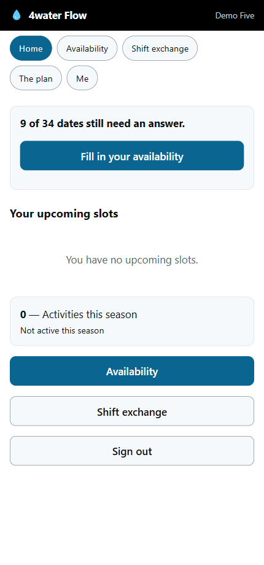
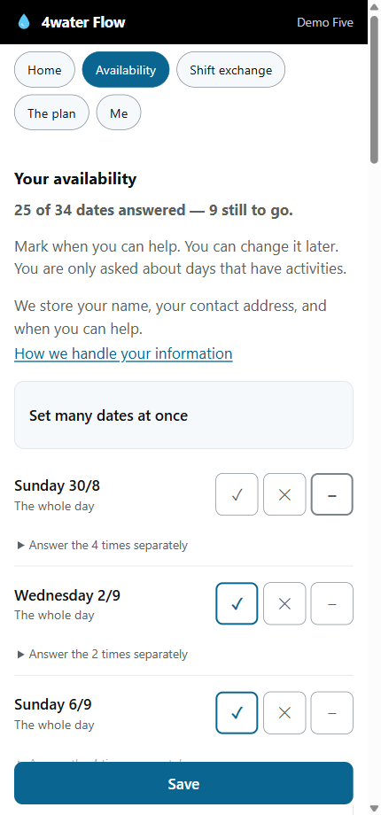
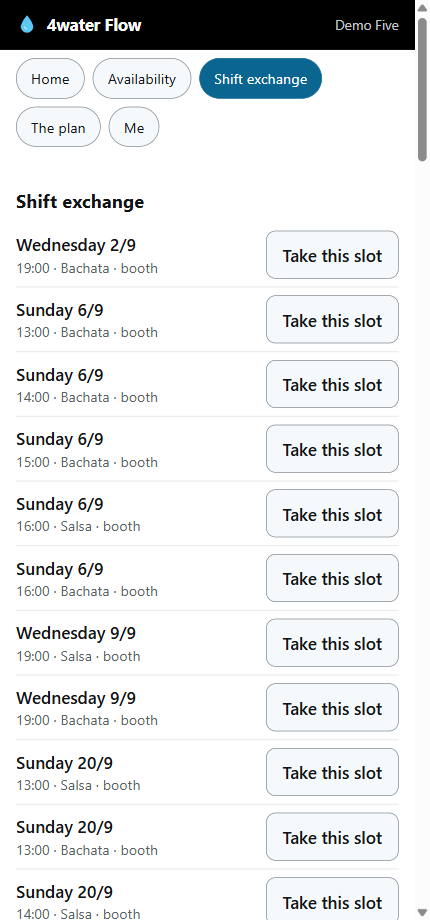
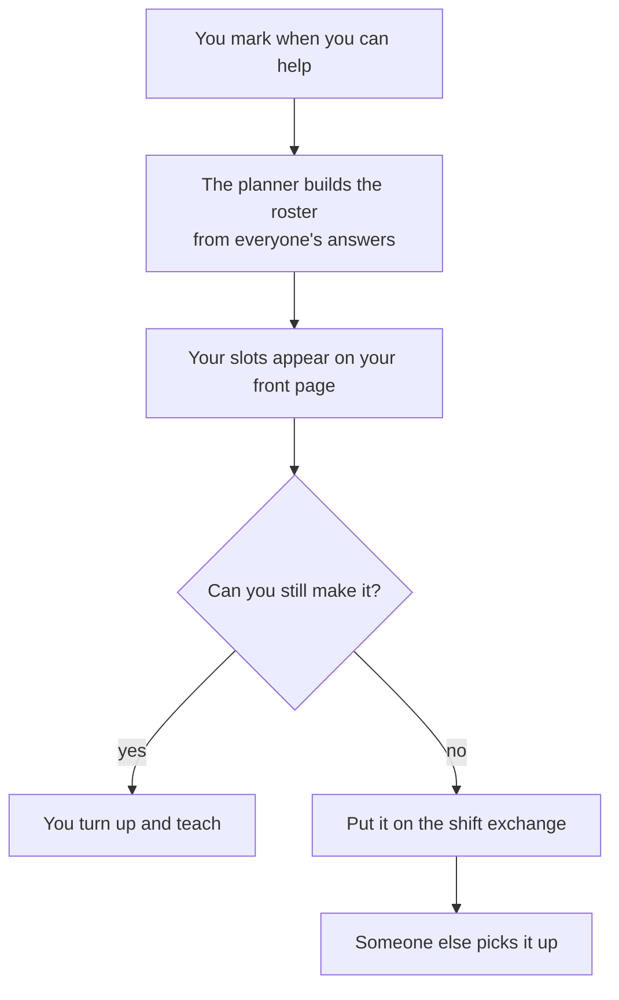
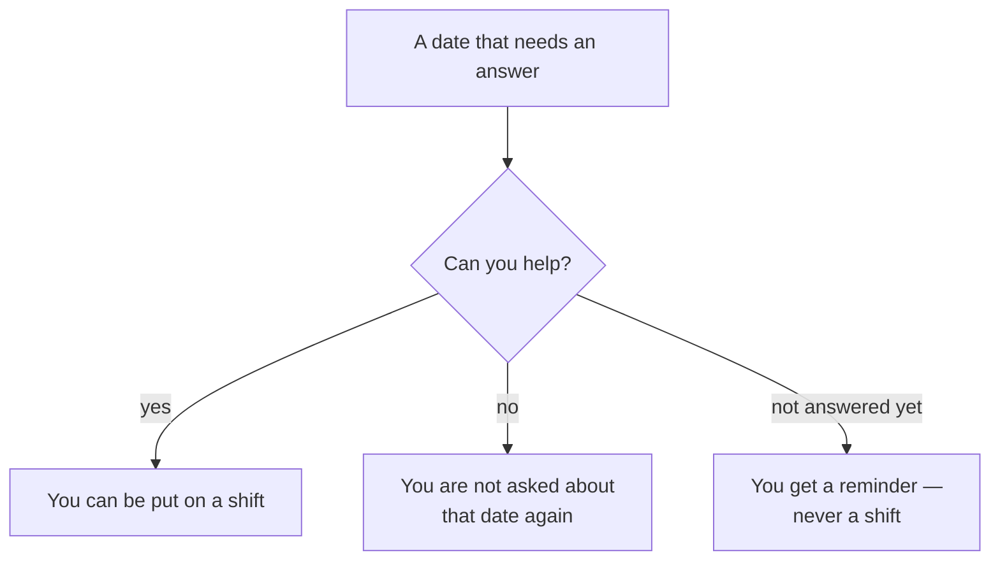

# What is this?

> **This is the simple version.** It rounds off corners and leaves things out on purpose.
> The precise version is in [README.md](README.md), and how to run it is in
> [RUNBOOK.md](RUNBOOK.md).

## In one sentence

It is the thing that replaced the volunteer rota spreadsheet — you say when you can help, and
it works out who is teaching what.

It is built for a phone, because the complaint about the spreadsheet was that it was a
nightmare to use on one.

  
  
  

## If you are a volunteer

**There is nothing to install and no password to make.** You get an invitation link, you open
it, and you are in.

Three things you can do:

**Say when you can help.** Tick a whole day, or open it up and answer each time separately.
You can change your mind later.

**See what you are on for.** Your upcoming slots are the first thing on the front page.

**Swap a shift.** Can't make one? Put it on the exchange. Want an extra? Take one off it.

## Yes, no, and not answered yet

There are three answers, not two — and the third one is the reason nobody gets signed up by
accident:

Silence is never read as agreement. Saying *no* is a real answer too, so you are not pestered
about a date you have already turned down.

## If you are the one making the rota

You get the season plan, a draft roster the app fills in for you, and the admin screens. It
knows who can teach what, that each class needs someone on the booth, and who has already said
no.

## If you are another organisation

Nothing about this is specific to us. The activities, the weekly rhythm, the times and every
word on screen come from configuration files, not from the code — so adapting it means editing
settings, not programming. A test fails the build if anything of ours leaks into the code.

## Setting it up

The easy part of this project. It runs straight from a copy of the code — no installer, no
build step, and nothing to download beyond the code itself. You need Node 22.13 or newer.

[RUNBOOK.md](RUNBOOK.md) covers running it properly, backups, and handing it to someone else.

## More

[README.md](README.md) · [How to run it](RUNBOOK.md) · Licence: AGPL-3.0-or-later
